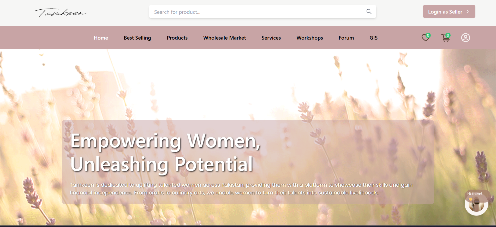
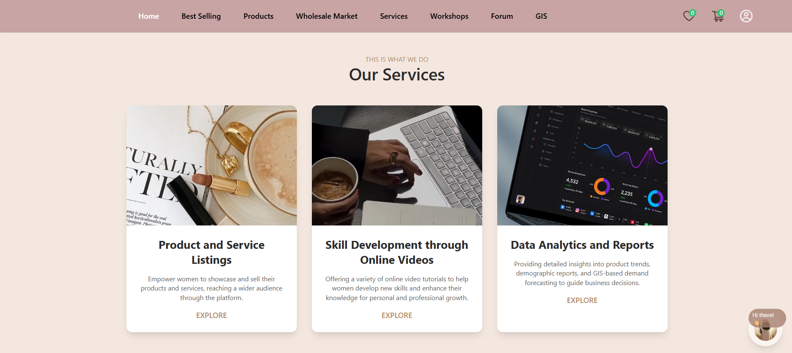
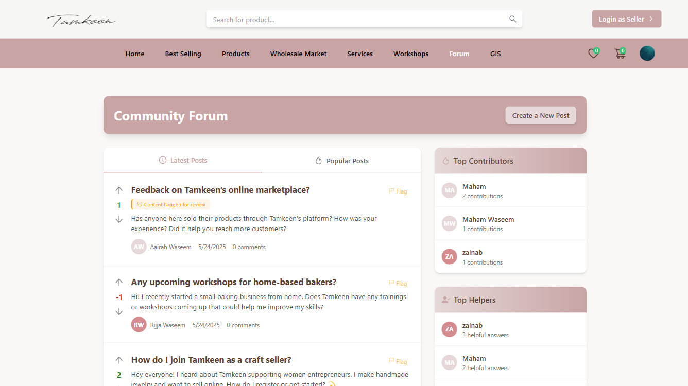
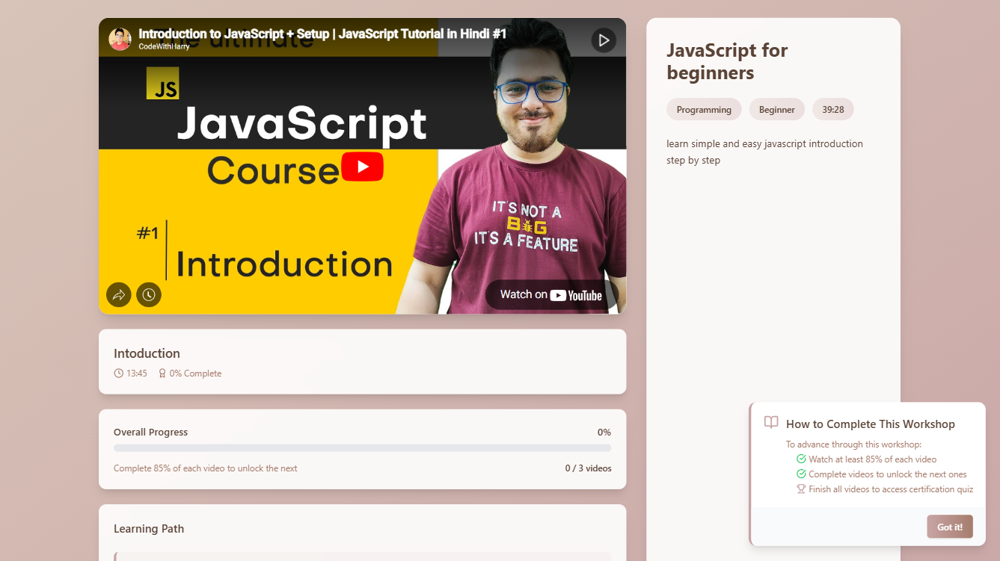
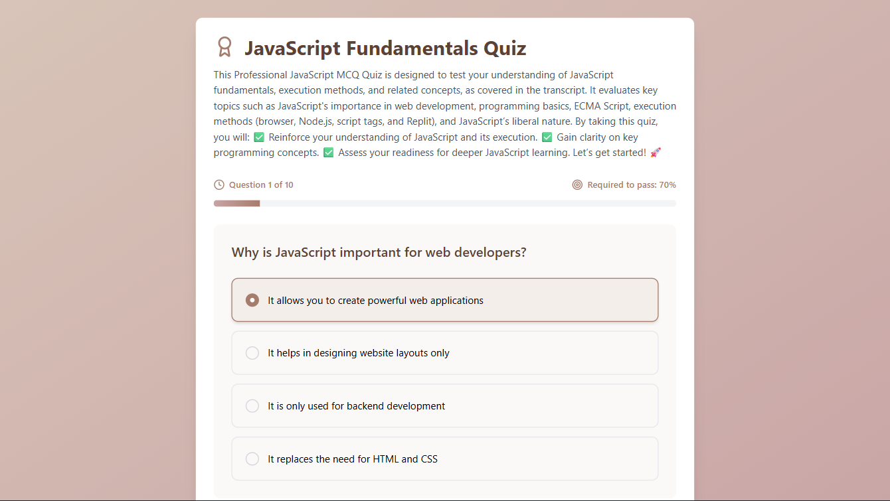
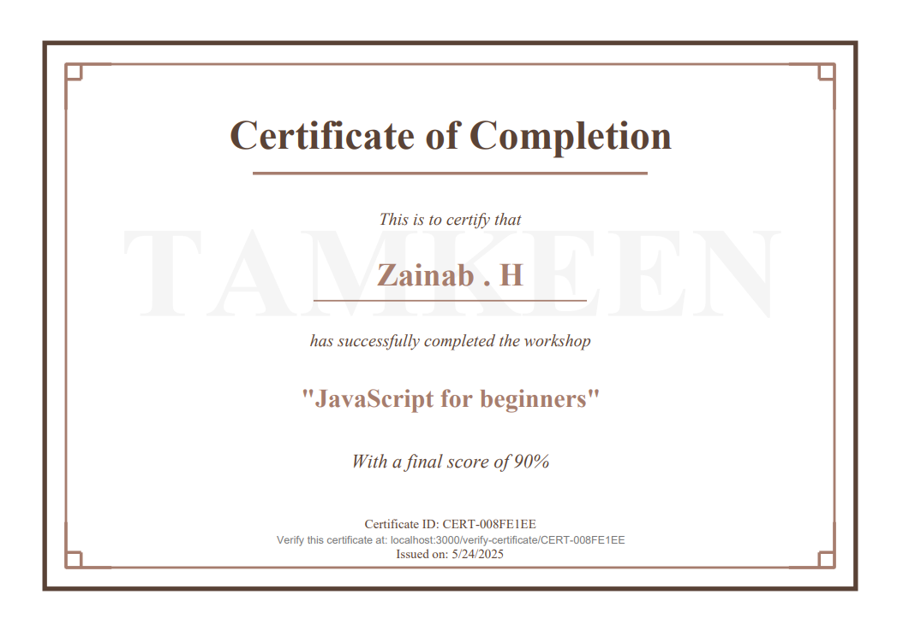
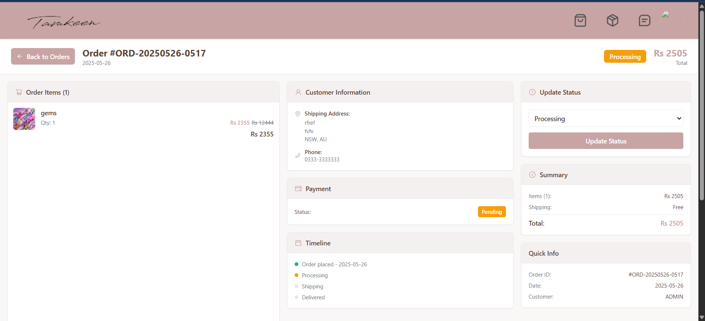
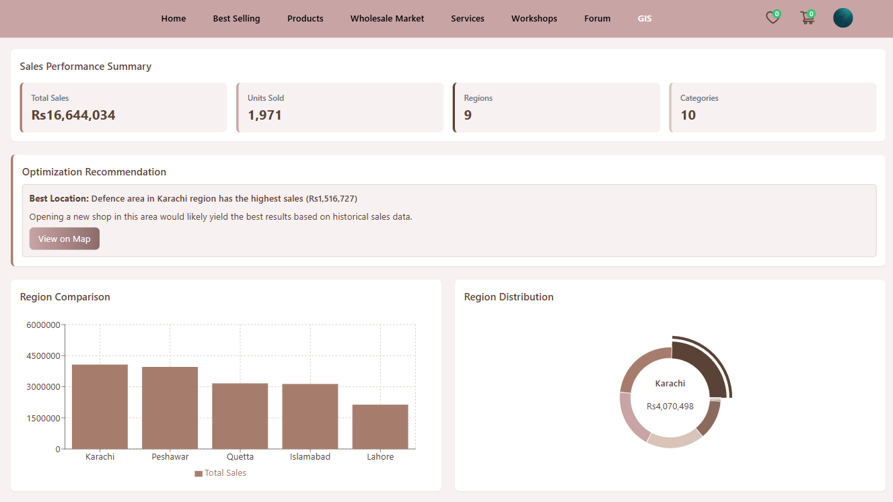
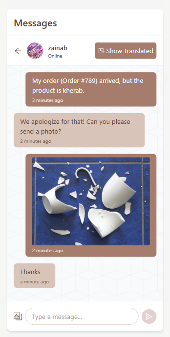
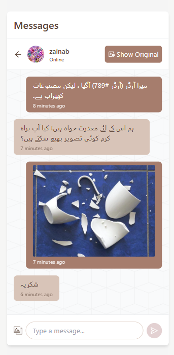

# Tamkeen 2.0 ✨

<div align="center">



**Empowerment Through Connection**

*A comprehensive platform built by women, for women - fostering skill development, networking, and financial independence*

[](https://www.mongodb.com/)
[](https://expressjs.com/)
[](https://reactjs.org/)
[](https://nodejs.org/)

</div>

---

## 📖 About Tamkeen

**Tamkeen** (تمكين) translates to "empowerment" in Arabic. This platform serves as a digital sanctuary where women can connect, learn, grow, and thrive together. Built on the MERN stack, Tamkeen 2.0 provides a comprehensive ecosystem for women to:

- 🎓 Acquire new skills through workshops and courses
- 💼 Build professional networks and mentorship connections
- 💰 Discover financial opportunities and entrepreneurship pathways
- 🗣️ Engage in meaningful discussions through community forums
- 🏆 Earn certifications and validate their expertise

---

## ✨ Key Features

### 🎯 Skill Development
- Interactive workshops and training sessions
- Self-paced learning modules
- Quiz-based assessments
- Digital certification upon completion

### 🤝 Networking Hub
- Real-time messaging with multi-language translation support
- Community forums for knowledge sharing
- Mentorship matching
- Professional profile building

### 💵 Financial Gateway
- E-commerce marketplace for women entrepreneurs
- Service listing and booking system
- Order management for sellers and buyers
- Secure payment integration

### 🗺️ GIS Integration
- Location-based services and resource mapping
- Find nearby workshops and events
- Connect with local women-led businesses

### 🔐 Security & Privacy
- Secure authentication with Passport.js
- Role-based access control
- Data encryption and protection

---

## 🛠️ Tech Stack

### Frontend


### Backend


### Additional Tools


---

## 🚀 Getting Started

### Prerequisites
- Node.js (v14 or higher)
- MongoDB (local or Atlas connection)
- npm or yarn package manager

### Installation

**1. Clone the repository**
```bash
git clone https://github.com/idkzeynav/Tamkeen2.0.git
cd Tamkeen2.0
```

**2. Install dependencies**

For the backend:
```bash
cd backend
npm install
```

For the frontend:
```bash
cd frontend
npm install
# or
yarn install
```

For the socket server:
```bash
cd socket
npm install
```

**3. Environment Configuration**

Create `.env` files in the respective directories:

**Backend `.env`:**
```env
MONGODB_URI=your_mongodb_connection_string
JWT_SECRET=your_jwt_secret
STRIPE_SECRET_KEY=your_stripe_secret_key
OPENAI_API_KEY=your_openai_api_key
PORT=5000
```

**Frontend `.env`:**
```env
REACT_APP_API_URL=http://localhost:5000
REACT_APP_SOCKET_URL=http://localhost:8900
```

**Socket `.env`:**
```env
PORT=8900
```

**4. Start the application**

Open three terminal windows:

Terminal 1 - Backend:
```bash
cd backend
npm start
# or use nodemon for development
nodemon server.js
```

Terminal 2 - Socket Server:
```bash
cd socket
npm start
```

Terminal 3 - Frontend:
```bash
cd frontend
npm start
# or
yarn start
```

**5. Access the application**

Open your browser and navigate to `http://localhost:3000`

---

## 📸 Screenshots

<details>
<summary>Click to view application screenshots</summary>

### Homepage


### Services


### Community Forum


### Workshops


### Quiz System


### Certifications


### Seller Dashboard


### GIS View


### Messaging - Original


### Messaging - Translated


</details>

---

## 🏗️ Project Structure
```
Tamkeen2.0/
├── backend/              # Express.js backend server
│   ├── controllers/      # Request handlers
│   ├── models/          # MongoDB models
│   ├── routes/          # API routes
│   ├── middleware/      # Custom middleware
│   └── config/          # Configuration files
├── frontend/            # React frontend
│   ├── src/
│   │   ├── components/  # Reusable components
│   │   ├── pages/       # Page components
│   │   ├── redux/       # State management
│   │   ├── services/    # API services
│   │   └── Assests/     # Static assets
│   └── public/          # Public files
└── socket/              # Socket.io server for real-time features
    └── server.js        # Socket server configuration
```

---

## 🤝 Contributing

We welcome contributions from the community! To contribute:

1. Fork the repository
2. Create a new branch (`git checkout -b feature/AmazingFeature`)
3. Commit your changes (`git commit -m 'Add some AmazingFeature'`)
4. Push to the branch (`git push origin feature/AmazingFeature`)
5. Open a Pull Request

Please ensure your code follows the existing style and includes appropriate tests.

---

## 📝 License

This project is open source and available under the [MIT License](LICENSE).

---

## 👥 Authors

- **Zeynav** - *Initial work* - [@idkzeynav](https://github.com/idkzeynav)

---

## 🙏 Acknowledgments

- Thanks to all the women who inspired this project
- The open-source community for the amazing tools and libraries
- All contributors who have helped shape Tamkeen 2.0

---

## 📧 Contact & Support

For questions, suggestions, or support:

- **GitHub Issues**: [Report a bug or request a feature](https://github.com/idkzeynav/Tamkeen2.0/issues)
- **Email**: Contact through GitHub profile

---

<div align="center">

**Made with ❤️ by women, for women**

*Empowering the next generation of female leaders and entrepreneurs*

⭐ If you find this project useful, please consider giving it a star!

</div>
